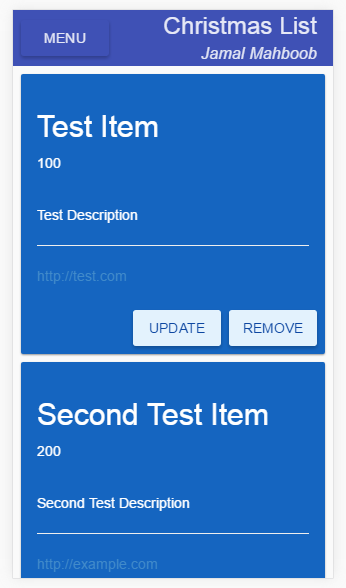
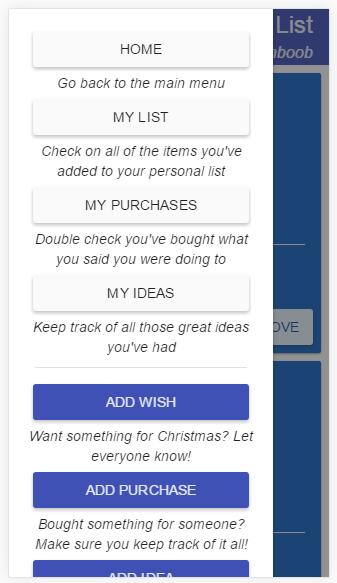

# ChristmasList
A small Flask + AngularJS based Christmas list application for my family to use this holiday season.

**In case anyone is wondering I'm using the Issues tab as a sort of "ToDo" list for the project.  I don't have some sort of split personality disorder where I'm commenting on my own work without realizing it.**

# Current (05 Oct 2016) System Images

# Dependencies (so far)

## Python

- Flask >= 0.11.1
- Flask-Login >= 0.3.2
- Flask-WTF >= 0.12
- Flask-bcrypt >= 0.7.1
- Flask-SQLAlchemy >= 2.1
- Flask-Security >= 1.7.5
- Flask-Principal >= 0.4.0
- SQLAlchemy >= 1.0.15

## JavaScript/CSS

- Bootstrap CSS >= 3.2.0
- Angular Bootstrap >= ???
- jQuery >= 2.2.1
- AngularJS >= 1.5.8 < 2.0.0
- Angular-Animate >= 1.5.8 < 2.0.0
- Angular-Smart-Table >= ???
